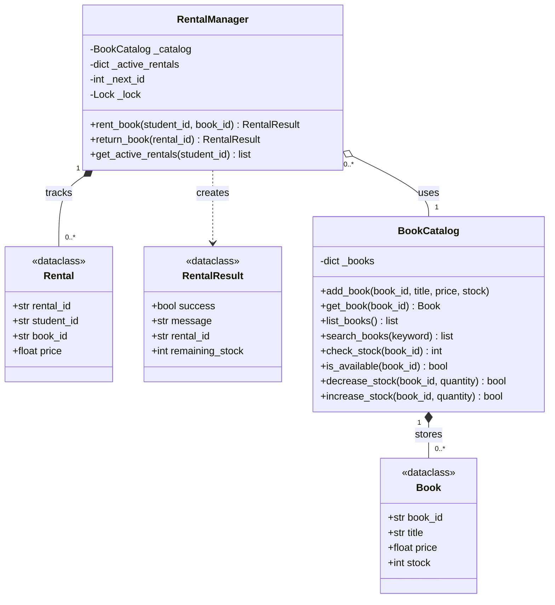
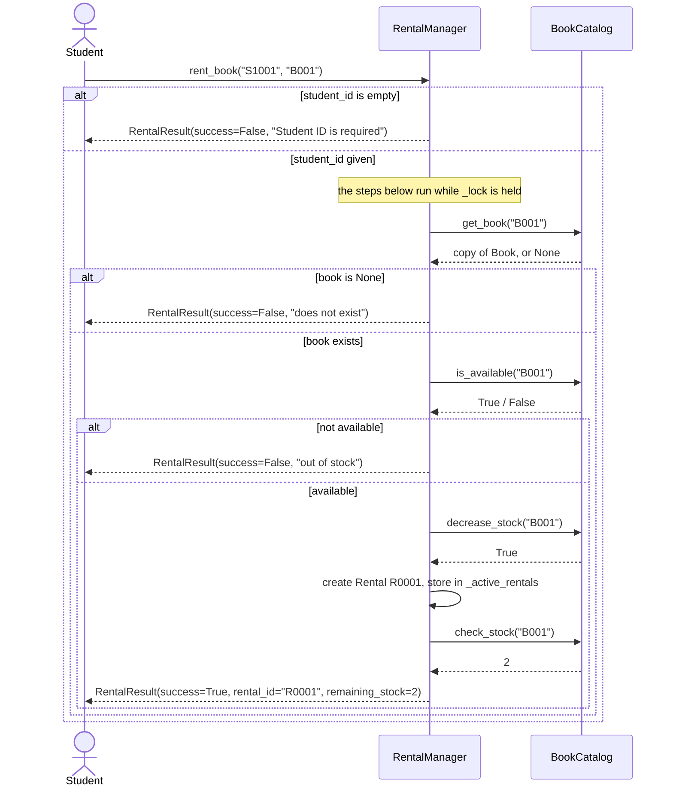

Mermaid versions of the two diagrams (same content as the .puml files).
Paste each block into https://mermaid.live to render it.

```mermaid
classDiagram
    class Book {
        <<dataclass>>
        +str book_id
        +str title
        +float price
        +int stock
    }
    class Rental {
        <<dataclass>>
        +str rental_id
        +str student_id
        +str book_id
        +float price
    }
    class RentalResult {
        <<dataclass>>
        +bool success
        +str message
        +str rental_id
        +int remaining_stock
    }
    class BookCatalog {
        -dict _books
        +add_book(book_id, title, price, stock)
        +get_book(book_id) Book
        +list_books() list
        +search_books(keyword) list
        +check_stock(book_id) int
        +is_available(book_id) bool
        +decrease_stock(book_id, quantity) bool
        +increase_stock(book_id, quantity) bool
    }
    class RentalManager {
        -BookCatalog _catalog
        -dict _active_rentals
        -int _next_id
        -Lock _lock
        +rent_book(student_id, book_id) RentalResult
        +return_book(rental_id) RentalResult
        +get_active_rentals(student_id) list
    }
    BookCatalog "1" *-- "0..*" Book : stores
    RentalManager "0..*" o-- "1" BookCatalog : uses
    RentalManager "1" *-- "0..*" Rental : tracks
    RentalManager ..> RentalResult : creates
```

```mermaid
sequenceDiagram
    actor Student
    participant RM as RentalManager
    participant BC as BookCatalog
    Student->>RM: rent_book("S1001", "B001")
    alt student_id is empty
        RM-->>Student: RentalResult(success=False, "Student ID is required")
    else student_id given
        Note over RM: the steps below run while _lock is held
        RM->>BC: get_book("B001")
        BC-->>RM: copy of Book, or None
        alt book is None
            RM-->>Student: RentalResult(success=False, "does not exist")
        else book exists
            RM->>BC: is_available("B001")
            BC-->>RM: True / False
            alt not available
                RM-->>Student: RentalResult(success=False, "out of stock")
            else available
                RM->>BC: decrease_stock("B001")
                BC-->>RM: True
                RM->>RM: create Rental R0001, store in _active_rentals
                RM->>BC: check_stock("B001")
                BC-->>RM: 2
                RM-->>Student: RentalResult(success=True, rental_id="R0001", remaining_stock=2)
            end
        end
    end
```
